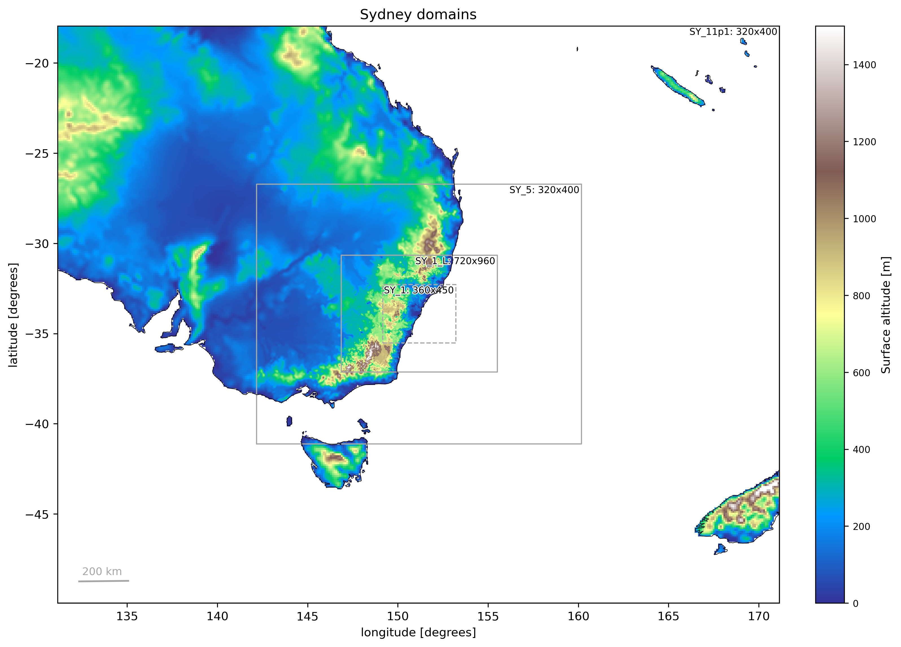
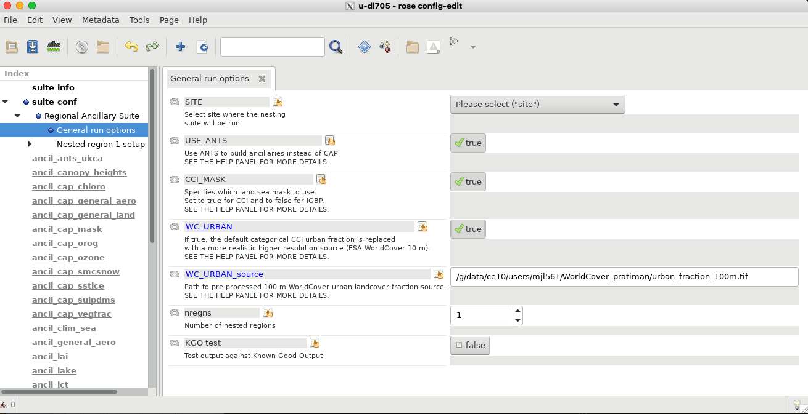

# RNS_SY_1km

This project documents various simulations over Sydney (down to 1km) using the ACCESS-NRI Regional Nesting Suite with pre-alpha OSTIA (varying sea surface temperature) capability. 

Most of the codebase is stored in [MOSRS](https://code.metoffice.gov.uk).
Plotting functions and some pre-processing stored here.

Contents:
- [Domains](#domains)
- [Experiments](#experiments)
- [Compute](#compute)
- [Ancillaries](#ancillaries)
    - [To create ancillaries](#to-create-ancillaries)
    - [Optional ancillary pre-processing](#optional-ancillary-pre-processing)
    - [Optional high res urban dataset](#optional-high-res-urban-dataset)
- [To run Regional Nesting Suite](#to-run-regional-nesting-suite)
- [Outputs](#outputs)
- [Converting from UM output to NETCDF4](#converting-from-um-output-to-netcdf4)
- [Plotting variables](#plotting-variables)
- [Analysis](#analysis)
- [Next Steps](#next-steps)

# Domains
Various ACCESS RNS runs to 1km resolution



Note the SY_1 and SY_1_L domains are both nested within SY_5 parent domain.
The larger domain may be used for offshore wind experiments, the smaller for assessment of Sydney urban effects.

## Experiments

So far 6 experiments have been undertaken:

|   | Shorthand        | Initialised with | Landcover                | Start    | End       |
|---|------------------|------------------|--------------------------|----------|-----------|
| 1 | E5L_CCI          | ERA5-Land        | CCI                      | 1/1/2017 | 28/1/2017 |
| 2 | E5L_CCI_WC       | ERA5-Land        | CCI + WorldCover (urban) | 1/1/2017 | 28/1/2017 |
| 3 | BR2_CCI          | BARRA-R2         | CCI                      | 1/1/2017 | 28/1/2017 |
| 4 | BR2_CCI_WC       | BARRA-R2         | CCI + WorldCover (urban) | 1/1/2017 | 28/1/2017 |
| 5 | BR2_CCI_no_urban | BARRA-R2         | CCI (urban removed)      | 1/1/2017 | 28/1/2017 |
| 6 | BR2_IGBP         | BARRA-R2         | IGBP                     | 1/1/2017 | 28/1/2017 |

All experiments include 4 resolutions (total of 24 model runs):

|   | Shorthand        | Resolution      | Grids               | Levset   | Science   |
|---|------------------|-----------------|---------------------|----------|-----------|
| 1 | 11p1 or 12p2     | 11.1 or 12.2 km | 320x400             | L70_80km | GAL9      |
| 2 | 5                | 5 km            | 320x400             | L70_80km | RAL3.2    |
| 3 | 1                | 1 km            | 360x450             | L90_40km | RAL3.2    |
| 4 | 1_L              | 1 km large      | 720x960             | L90_40km | RAL3.2    |
| 5 | BR2_CCI_no_urban | BARRA-R2        | CCI (urban removed) | 1/1/2017 | 28/1/2017 |
| 6 | BR2_IGBP         | BARRA-R2        | IGBP                | 1/1/2017 | 28/1/2017 |

All ERA5-Land initialised experiments use the same parent setup: 11.1 km grid with CCI land cover
Likewise all BARRA-R2 initialised experiments use 12.2 km grid with CCI land cover

## Compute

Approximate values:

|               | y_npts | x_npts | nproc | CPUS | SU 24hrs | walltime 24hrs |
|---------------|--------|--------|-------|------|----------|----------------|
| ec_recon      | 340    | 420    | 12x16 | 192  | 192      | 1 min          |
| SY_11p1/12p2  | 320    | 400    | 12x16 | 192  | 60       | 10 mins        |
| SY_5          | 320    | 400    | 12x16 | 192  | 110      | 18 mins        |
| SY_1          | 360    | 450    | 18x16 | 288  | 450      | 36 mins        |
| SY_1_L        | 720    | 960    | 32x36 | 1152 | 1700     | 45 mins        |
|               |        |        |       |      |          |                |
| Total (small) |        |        |       |      | 740      | SU             |
| Total (large) |        |        |       |      | 1990     | SU             |


# Ancillaries

## To create ancillaries

```
# log into MOSRS
module use /g/data/hr22/modulefiles
module load cylc7/23.09
mosrs-auth

# checkout updated version of the Regional Ancillary Suite (u-bu503)
rosie co u-dl705
cd u-dl705

# run with optional file to create 4 regions
rose suite-run -O SY_1km
```

Ancillaries will be created in  `$HOME/cylc-run/u-dl705/share/data/ancils/SY_CCI`. Generation takes ~ 30 minutes.

## Optional ancillary pre-processing

The "WorldCover urban" option has been incorporated into u-dg767 (see below).

The "No urban" option is a custom pre-processing script included in this repository [here](ancil_code/ancil_lct_postproc_no_urban.py). It must be run while u-dg767 is held prior to the ancil_lct_postproc_c4 task. See insturctions in that file.

## Optional high res urban dataset
u-dl705 has been updated to allow a switch which replaces any urban tile with a very high resolution dataset (10 m WorldCover)

Either edit `rose-suite.conf` variables as follows:

```
WC_URBAN=true
WC_URBAN_source="/g/data/ce10/users/mjl561/WorldCover_pratiman/urban_fraction_100m.tif"
```
Or click in the GUI:



Without access to /g/data/ce10, you will need to download the [source data](https://doi.org/10.5281/zenodo.7298393.) and point your suite to it.

## Ancillary code MOSRS repositories

The ancillary generation suite for SY_1km (u-dl705) is based on the Regional Ancillary Suite (u-bu503), located on MOSRS [here](https://code.metoffice.gov.uk/trac/roses-u/browser/d/l/7/0/5/trunk).

u-dl705 includes a new optional configuration file [here](
https://code.metoffice.gov.uk/trac/roses-u/browser/d/l/7/0/5/trunk/opt/rose-suite-SY_1km.conf).

u-dl705 also checks out a new branch of the ANTS contrib code to allow a larger spiral search radius, as documented on ACCESS-hive [here](
https://forum.access-hive.org.au/t/aus2200-vegetation-fraction-ancil-creation-issues/1972/20), as well as an option to use WorldCover in urban areas.

This new ANTS contrib branch is located [here](
https://code.metoffice.gov.uk/trac/ancil/log/contrib/branches/dev/mathewlipson/r14121_RAS_CONTRIB_1p0_large_spiral).

Some special ancillary options include WorldCover and CCI with urban removed. See below.

# To run Regional Nesting Suite

```
# log into MOSRS as above

# checkout SY_1km version of ACCESS regional nesting suite
rosie co u-dg768/rns_ostia_sydney_1km
cd u-dg768

# run with default settings (BARRA-R2 with CCI and CCI+WC)
rose suite-run

# OR run with appropriate option file overide, e.g. 
rose suite-run -O nci_SY_1km_era5land

# OR
rose suite-run -O nci_SY_1km_IGBP_no_urban
```

Suite takes approximately 1 hr/ day.

# Outputs

The 5 and 1 km simulutions have 94 saved outputs (see table below). Some are at mulitiple model heights, soil levels or across multiple land tiles, so total outputs are >> 100. 

Outputs include an ammended VERstash: [`u-dg768/app/um/opt/rose-app-stashpack1.conf`](https://code.metoffice.gov.uk/trac/roses-u/browser/d/g/7/6/8/rns_ostia_sydney_1km/app/um/opt/rose-app-stashpack1.conf)

As well as a new custom STASHpack: [`u-dg768/app/um/opt/rose-app-stashpack6.conf`)](https://code.metoffice.gov.uk/trac/roses-u/browser/d/g/7/6/8/rns_ostia_sydney_1km/app/um/opt/rose-app-stashpack6.conf)

VERstash (stashpack1) has been ammended so that 3D fields are output hourly (rather than 3 hourly),
and all single step outputs (VTS0 and VTS1) have been removed (not necessary in free-running mode).

## stashpack1:

| #  | VERstash id    | STASH name                           | isec | item | stash      | tim_name | file      | type     | period | output | height    | short code |
|----|----------------|--------------------------------------|------|------|------------|----------|-----------|----------|--------|--------|-----------|------------|
| 1  | 00023_166e76cf | SNOW AMOUNT OVER LAND AFT TSTP KG/M2 | 0    | 23   | m01s00i023 | VT1HR    | VERDIAGS1 | instant. |        | hour   |           | 00023      |
| 2  | 00024_06e1fc7f | SURFACE TEMPERATURE AFTER TIMESTEP   | 0    | 24   | m01s00i024 | VT1HR    | VERDIAGS1 | instant. |        | hour   |           | 00024      |
| 3  | 00025_08c67fdc | BOUNDARY LAYER DEPTH AFTER TIMESTEP  | 0    | 25   | m01s00i025 | VT3HR    | VERDIAGS1 | instant. |        | 3 hour |           | 00025      |
| 4  | 00031_9f4e1b5a | FRAC OF SEA ICE IN SEA AFTER TSTEP   | 0    | 31   | m01s00i031 | VT1HR    | VERDIAGS1 | instant. |        | hour   |           | 00031      |
| 5  | 00409_4dd83478 | SURFACE PRESSURE AFTER TIMESTEP      | 0    | 409  | m01s00i409 | VT3HR    | VERDIAGS1 | instant. |        | 3 hour |           | 00409      |
| 6  | 01202_8d02003e | NET DOWN SURFACE SW FLUX : CORRECTED | 1    | 202  | m01s01i202 | VT1HR    | VERDIAGS1 | instant. |        | hour   |           | 01202      |
| 7  | 01205_651c562e | OUTGOING SW RAD FLUX (TOA):CORRECTED | 1    | 205  | m01s01i205 | VT1HR    | VERDIAGS1 | instant. |        | hour   |           | 01205      |
| 8  | 01207_7d9bde37 | INCOMING SW RAD FLUX (TOA): ALL TSS  | 1    | 207  | m01s01i207 | VT1HR    | VERDIAGS1 | instant. |        | hour   |           | 01207      |
| 9  | 01208_ec154294 | OUTGOING SW RAD FLUX (TOA)           | 1    | 208  | m01s01i208 | VT1HR    | VERDIAGS1 | instant. |        | hour   |           | 01208      |
| 10 | 01235_85923c51 | TOTAL DOWNWARD SURFACE SW FLUX       | 1    | 235  | m01s01i235 | VT1HR    | VERDIAGS1 | instant. |        | hour   |           | 01235      |
| 11 | 02201_50cdea4c | NET DOWN SURFACE LW RAD FLUX         | 2    | 201  | m01s02i201 | VT1HR    | VERDIAGS1 | instant. |        | hour   |           | 02201      |
| 12 | 02205_1a540971 | OUTGOING LW RAD FLUX (TOA)           | 2    | 205  | m01s02i205 | VT1HR    | VERDIAGS1 | instant. |        | hour   |           | 02205      |
| 13 | 02207_8b3500ea | DOWNWARD LW RAD FLUX: SURFACE        | 2    | 207  | m01s02i207 | VT1HR    | VERDIAGS1 | instant. |        | hour   |           | 02207      |
| 14 | 03217_f358020f | SURFACE SENSIBLE HEAT FLUX W/M2      | 3    | 217  | m01s03i217 | VT1HR    | VERDIAGS1 | instant. |        | hour   |           | 03217      |
| 15 | 03225_a3d43c5a | 10 METRE WIND U-COMP B GRID          | 3    | 225  | m01s03i225 | VT1HR    | VERDIAGS1 | instant. |        | hour   |           | 03225      |
| 16 | 03226_5d3eca37 | 10 METRE WIND V-COMP B GRID          | 3    | 226  | m01s03i226 | VT1HR    | VERDIAGS1 | instant. |        | hour   |           | 03226      |
| 17 | 03234_4a6fa10f | SURFACE LATENT HEAT FLUX W/M2        | 3    | 234  | m01s03i234 | VT1HR    | VERDIAGS1 | instant. |        | hour   |           | 03234      |
| 18 | 03236_11c174ad | TEMPERATURE AT 1.5M                  | 3    | 236  | m01s03i236 | VT1HR    | VERDIAGS1 | instant. |        | hour   |           | 03236      |
| 19 | 03245_74998aee | RELATIVE HUMIDITY AT 1.5M            | 3    | 245  | m01s03i245 | VT1HR    | VERDIAGS1 | instant. |        | hour   |           | 03245      |
| 20 | 03248_83ef074c | FOG FRACTION AT 1.5 M                | 3    | 248  | m01s03i248 | VT1HR    | VERDIAGS1 | instant. |        | hour   |           | 03248      |
| 21 | 03250_77662b6a | DEWPOINT AT 1.5M (K)                 | 3    | 250  | m01s03i250 | VT1HR    | VERDIAGS1 | instant. |        | hour   |           | 03250      |
| 22 | 03253_23e8c5ac | PROBABILITY OF VIS LESS THAN 5 KM    | 3    | 253  | m01s03i253 | VT1HR    | VERDIAGS1 | instant. |        | hour   |           | 03253      |
| 23 | 03281_55d56927 | VIS AT 1.5M (incl precip) M          | 3    | 281  | m01s03i281 | VT1HR    | VERDIAGS1 | instant. |        | hour   |           | 03281      |
| 24 | 03304_d920131c | TURBULENT MIXING HT AFTER B.LAYER m  | 3    | 304  | m01s03i304 | VT1HR    | VERDIAGS1 | instant. |        | hour   |           | 03304      |
| 25 | 03310_4ad485b4 | CUMULUS-CAPPED BL INDICATOR          | 3    | 310  | m01s03i310 | VT1HR    | VERDIAGS1 | instant. |        | hour   |           | 03310      |
| 26 | 03463_c04c2215 | WIND GUST                            | 3    | 463  | m01s03i463 | VT1HRMAX | VERDIAGS1 | max      |        | hour   |           | 03463      |
| 27 | 04112_a98da420 | RADAR REFLECTIVITY AT 1KM AGL (dBZ)  | 4    | 112  | m01s04i112 | VT1HR    | VERDIAGS2 | instant. |        | hour   | 1km       | 04112      |
| 28 | 04112_ae382cbd | RADAR REFLECTIVITY AT 1KM AGL (dBZ)  | 4    | 112  | m01s04i112 | VT1HR_MN | VERDIAGS2 | mean     | hour   | hour   | 1km       | 04112      |
| 29 | 04201_084db668 | LARGE SCALE RAIN AMOUNT     KG/M2/TS | 4    | 201  | m01s04i201 | VTACC1HR | VERDIAGS2 | accum    | hour   | hour   |           | 04201      |
| 30 | 04202_24520454 | LARGE SCALE SNOW AMOUNT     KG/M2/TS | 4    | 202  | m01s04i202 | VTACC1HR | VERDIAGS2 | accum    | hour   | hour   |           | 04202      |
| 31 | 04203_ccc272f3 | LARGE SCALE RAINFALL RATE KG/M2/S    | 4    | 203  | m01s04i203 | VT1HR    | VERDIAGS2 | instant. |        | hour   |           | 04203      |
| 32 | 04203_de517c66 | LARGE SCALE RAINFALL RATE KG/M2/S    | 4    | 203  | m01s04i203 | VT1HR_MN | VERDIAGS2 | mean     | hour   | hour   |           | 04203      |
| 33 | 04204_3317bfd0 | LARGE SCALE SNOWFALL RATE KG/M2/S    | 4    | 204  | m01s04i204 | VT1HR_MN | VERDIAGS2 | mean     | hour   | hour   |           | 04204      |
| 34 | 04204_6a50d163 | LARGE SCALE SNOWFALL RATE KG/M2/S    | 4    | 204  | m01s04i204 | VT1HR    | VERDIAGS2 | instant. |        | hour   |           | 04204      |
| 35 | 05201_304d5ee1 | CONVECTIVE RAIN AMOUNT   KG/M2/TS    | 5    | 201  | m01s05i201 | VTACC1HR | VERDIAGS2 | accum    | hour   | hour   |           | 05201      |
| 36 | 05202_19119fec | CONVECTIVE SNOW AMOUNT   KG/M2/TS    | 5    | 202  | m01s05i202 | VTACC1HR | VERDIAGS2 | accum    | hour   | hour   |           | 05202      |
| 37 | 05205_00a9944f | CONVECTIVE RAINFALL RATE KG/M2/S     | 5    | 205  | m01s05i205 | VT1HR_MN | VERDIAGS2 | mean     | hour   | hour   |           | 05205      |
| 38 | 05205_6c64e388 | CONVECTIVE RAINFALL RATE KG/M2/S     | 5    | 205  | m01s05i205 | VT1HR    | VERDIAGS2 | instant. |        | hour   |           | 05205      |
| 39 | 05206_26b034a5 | CONVECTIVE SNOWFALL RATE KG/M2/S     | 5    | 206  | m01s05i206 | VT1HR_MN | VERDIAGS2 | mean     | hour   | hour   |           | 05206      |
| 40 | 05206_96a067e0 | CONVECTIVE SNOWFALL RATE KG/M2/S     | 5    | 206  | m01s05i206 | VT1HR    | VERDIAGS2 | instant. |        | hour   |           | 05206      |
| 41 | 05216_3cf642c7 | TOTAL PRECIPITATION RATE KG/M2/S     | 5    | 216  | m01s05i216 | VT1HR_MN | VERDIAGS2 | mean     | hour   | hour   |           | 05216      |
| 42 | 05216_6e58da7e | TOTAL PRECIPITATION RATE KG/M2/S     | 5    | 216  | m01s05i216 | VT1HR    | VERDIAGS2 | instant. |        | hour   |           | 05216      |
| 43 | 05226_6ea74fb6 | TOTAL PRECIPITATION AMOUNT  KG/M2/TS | 5    | 226  | m01s05i226 | VTACC1HR | VERDIAGS2 | accum    | hour   | hour   |           | 05226      |
| 44 | 08223_a0e02cdb | SOIL MOISTURE CONTENT IN A LAYER     | 8    | 223  | m01s08i223 | VT1HR    | VERDIAGS2 | instant. |        | hour   | soil 4L   | 08223      |
| 45 | 08225_04de29ca | DEEP SOIL TEMP. AFTER HYDROLOGY DEGK | 8    | 225  | m01s08i225 | VT1HR    | VERDIAGS2 | instant. |        | hour   | soil 4L   | 08225      |
| 46 | 09202_7d725562 | VERY LOW CLOUD AMOUNT                | 9    | 202  | m01s09i202 | VT1HR    | VERDIAGS2 | instant. |        | hour   |           | 09202      |
| 47 | 09202_86a44b1e | VERY LOW CLOUD AMOUNT                | 9    | 202  | m01s09i202 | VT1HR_MN | VERDIAGS2 | mean     | hour   | hour   |           | 09202      |
| 48 | 09203_a68d1750 | LOW CLOUD AMOUNT                     | 9    | 203  | m01s09i203 | VT1HR    | VERDIAGS2 | instant. |        | hour   |           | 09203      |
| 49 | 09203_f7348dbb | LOW CLOUD AMOUNT                     | 9    | 203  | m01s09i203 | VT1HR_MN | VERDIAGS2 | mean     | hour   | hour   |           | 09203      |
| 50 | 09204_8a815708 | MEDIUM CLOUD AMOUNT                  | 9    | 204  | m01s09i204 | VT1HR_MN | VERDIAGS2 | mean     | hour   | hour   |           | 09204      |
| 51 | 09204_f8b4b5bc | MEDIUM CLOUD AMOUNT                  | 9    | 204  | m01s09i204 | VT1HR    | VERDIAGS2 | instant. |        | hour   |           | 09204      |
| 52 | 09205_1751ec0d | HIGH CLOUD AMOUNT                    | 9    | 205  | m01s09i205 | VT1HR_MN | VERDIAGS2 | mean     | hour   | hour   |           | 09205      |
| 53 | 09205_e79bd608 | HIGH CLOUD AMOUNT                    | 9    | 205  | m01s09i205 | VT1HR    | VERDIAGS2 | instant. |        | hour   |           | 09205      |
| 54 | 09210_4452b33e | CLOUD BASE ASL COVER.GT.2.5 OCTA KFT | 9    | 210  | m01s09i210 | VT1HR    | VERDIAGS2 | instant. |        | hour   |           | 09210      |
| 55 | 09217_ddbbe4d2 | TOTAL CLOUD AMOUNT MAX/RANDOM OVERLP | 9    | 217  | m01s09i217 | VT1HR    | VERDIAGS2 | instant. |        | hour   |           | 09217      |
| 56 | 09218_eda98d8f | CLOUD FRACTION BELOW 1000 FT ASL     | 9    | 218  | m01s09i218 | VT1HR    | VERDIAGS2 | instant. |        | hour   |           | 09218      |
| 57 | 09233_ef79ad5e | CEILOMETER CLD AMT MAX/RANDOM OVERLP | 9    | 233  | m01s09i233 | VT1HR    | VERDIAGS2 | instant. |        | hour   |           | 09233      |
| 58 | 15142_dcc24c36 | W ON GEOMETRIC HEIGHT LEVELS         | 15   | 142  | m01s15i142 | VT1HR    | VERDIAGS2 | instant. |        | hour   | 8km       | 15142      |
| 59 | 15201_46cf028c | U WIND ON PRESSURE LEVELS B GRID     | 15   | 201  | m01s15i201 | VT1HR    | VERDIAGS3 | instant. |        | hour   | pres. 16L | 15201      |
| 60 | 15202_0ef92709 | V WIND ON PRESSURE LEVELS B GRID     | 15   | 202  | m01s15i202 | VT1HR    | VERDIAGS3 | instant. |        | hour   | pres. 16L | 15202      |
| 61 | 15242_ab127cbb | W COMPNT (OF WIND) ON PRESSURE LEVS  | 15   | 242  | m01s15i242 | VT1HR    | VERDIAGS3 | instant. |        | hour   | pres. 16L | 15242      |
| 62 | 16202_d378ef44 | GEOPOTENTIAL HEIGHT ON P LEV/P GRID  | 16   | 202  | m01s16i202 | VT1HR    | VERDIAGS4 | instant. |        | hour   | pres. 16L | 16202      |
| 63 | 16203_25bfc009 | TEMPERATURE ON P LEV/P GRID          | 16   | 203  | m01s16i203 | VT1HR    | VERDIAGS4 | instant. |        | hour   | pres. 16L | 16203      |
| 64 | 16204_c6b2c71b | RH WRT ICE ON P LEV/P GRID           | 16   | 204  | m01s16i204 | VT1HR    | VERDIAGS4 | instant. |        | hour   | pres. 16L | 16204      |
| 65 | 16205_63711f64 | WET BULB POTENTIAL TEMPERATURE K     | 16   | 205  | m01s16i205 | VT1HR    | VERDIAGS4 | instant. |        | hour   | pres. 16L | 16205      |
| 66 | 16222_a2d40ec1 | PRESSURE AT MEAN SEA LEVEL           | 16   | 222  | m01s16i222 | VT1HR    | VERDIAGS2 | instant. |        | hour   |           | 16222      |
| 67 | 30403_17fd9ed2 | TOTAL COLUMN DRY MASS RHO GRID       | 30   | 403  | m01s30i403 | VT1HR    | VERDIAGS2 | instant. |        | hour   |           | 30403      |
| 68 | 30404_4172968c | TOTAL COLUMN WET MASS RHO GRID       | 30   | 404  | m01s30i404 | VT1HR    | VERDIAGS2 | instant. |        | hour   |           | 30404      |
| 69 | 30405_8c4bdd67 | TOTAL COLUMN QCL RHO GRID            | 30   | 405  | m01s30i405 | VT1HR    | VERDIAGS2 | instant. |        | hour   |           | 30405      |
| 70 | 30406_98bb276c | TOTAL COLUMN QCF RHO GRID            | 30   | 406  | m01s30i406 | VT1HR    | VERDIAGS2 | instant. |        | hour   |           | 30406      |
| 71 | 30461_d63f4d64 | TOTAL COLUMN Q (WATER VAPOUR PATH)   | 30   | 461  | m01s30i461 | VT1HR    | VERDIAGS2 | instant. |        | hour   |           | 30461      |

## stashpack6:

| #  | VERstash id    | STASH name                                            | isec | item | stash      | type     | period | output | tim_name | file       | height   | short code |
|----|----------------|-------------------------------------------------------|------|------|------------|----------|--------|--------|----------|------------|----------|------------|
| 72 | 01202_15d5af06 | NET DOWN SURFACE SW FLUX : CORRECTED                  | 1    | 202  | m01s01i202 | mean     | hour   | hour   | FM1HR    | SURFDIAGS1 |          |      01202 |
| 73 | 01235_0afe645e | TOTAL DOWNWARD SURFACE SW FLUX                        | 1    | 235  | m01s01i235 | mean     | hour   | hour   | FM1HR    | SURFDIAGS1 |          |      01235 |
| 74 | 02201_846c955e | NET DOWN SURFACE LW RAD FLUX                          | 2    | 201  | m01s02i201 | mean     | hour   | hour   | FM1HR    | SURFDIAGS1 |          |      02201 |
| 75 | 02207_7380460a | DOWNWARD LW RAD FLUX: SURFACE                         | 2    | 207  | m01s02i207 | mean     | hour   | hour   | FM1HR    | SURFDIAGS1 |          |      02207 |
| 76 | 03202_4b8bce63 | HT FLUX FROM SURF TO DEEP SOIL LEV 1                  | 3    | 202  | m01s03i202 | mean     | hour   | hour   | FM1HR    | SURFDIAGS1 |          |      03202 |
| 77 | 03217_2c5f66cc | SURFACE SENSIBLE HEAT FLUX W/M2                       | 3    | 217  | m01s03i217 | mean     | hour   | hour   | FM1HR    | SURFDIAGS1 |          |      03217 |
| 78 | 03234_783408c1 | SURFACE LATENT HEAT FLUX W/M2                         | 3    | 234  | m01s03i234 | mean     | hour   | hour   | FM1HR    | SURFDIAGS1 |          |      03234 |
| 79 | 00010_0379d9ac | SPECIFIC HUMIDITY AFTER TIMESTEP (lowest atmos level) | 0    | 10   | m01s00i010 | instant. |        | hour   | FT1HR    | SURFDIAGS3 | 5m       |      00010 |
| 80 | 03237_0379d9ac | SPECIFIC HUMIDITY AT 1.5M                             | 3    | 237  | m01s03i237 | instant. |        | hour   | FT1HR    | SURFDIAGS3 | 1.5m     |      03237 |
| 81 | 03500_0d3027d1 | IMPLICIT FRICTION VELOCITY                            | 3    | 500  | m01s03i500 | instant. |        | hour   | FT1HR    | SURFDIAGS3 |          |      03500 |
| 82 | 03296_abdcb754 | EVAP FROM SOIL SURF : RATE KG/M2/S                    | 3    | 296  | m01s03i296 | mean     | hour   | hour   | FM1HR    | SURFDIAGS3 |          |      03296 |
| 83 | 03297_16633cba | EVAP FROM CANOPY : RATE KG/M2/S                       | 3    | 297  | m01s03i297 | mean     | hour   | hour   | FM1HR    | SURFDIAGS3 |          |      03297 |
| 84 | 03232_16633cba | EVAP FROM OPEN SEA: SEA MEAN KG/M2/S                  | 3    | 232  | m01s03i232 | mean     | hour   | hour   | FM1HR    | SURFDIAGS3 |          |      03232 |
| 85 | 03223_16634cba | SURFACE TOTAL MOISTURE FLUX KG/M2/S                   | 3    | 223  | m01s03i223 | mean     | hour   | hour   | FM1HR    | SURFDIAGS3 |          |      03223 |
| 86 | 03304_af706631 | TURBULENT MIXING HT AFTER B.LAYER m                   | 3    | 304  | m01s03i304 | instant. |        | hour   | FT1HR    | SURFDIAGS3 |          |      03304 |
| 87 | 03316_f9b12f1d | SURFACE TEMP ON TILES K                               | 3    | 316  | m01s03i316 | instant. |        | hour   | FT1HR    | SURFDIAGS4 | 10 tiles |      03316 |
| 88 | 03328_9c59b170 | 1.5M TEMPERATURE OVER TILES                           | 3    | 328  | m01s03i328 | instant. |        | hour   | FT1HR    | SURFDIAGS4 | 10 tiles |      03328 |
| 89 | 30462_cb5ff1d5 | TOTAL MOISTURE FLUX U  RHO GRID                       | 30   | 462  | m01s30i462 | mean     | hour   | hour   | FM1HR    | SURFDIAGS3 |          |      30462 |
| 90 | 30463_cb5ff1d6 | TOTAL MOISTURE FLUX V  RHO GRID                       | 30   | 463  | m01s30i463 | mean     | hour   | hour   | FM1HR    | SURFDIAGS3 |          |      30463 |
| 91 | 08209_d1c3c4c6 | CANOPY WATER CONTENT                                  | 8    | 209  | m01s08i209 | mean     | hour   | hour   | FM1HR    | SURFDIAGS2 |          |      08209 |
| 92 | 08234_a12afd9d | SURFACE RUNOFF RATE KG/M2/S                           | 8    | 234  | m01s08i234 | mean     | hour   | hour   | FM1HR    | SURFDIAGS2 |          |      08234 |
| 93 | 08235_22146f14 | SUB-SURFACE RUNOFF RATE KG/M2/S                       | 8    | 235  | m01s08i235 | mean     | hour   | hour   | FM1HR    | SURFDIAGS2 |          |      08235 |
| 94 | 08230_cb5ff1d4 | FROZEN SOIL MOISTURE FRACTION                         | 8    | 230  | m01s08i230 | instant. |        | hour   | FT1HR    | SURFDIAGS2 |          |      08230 |

# Converting from UM output to NETCDF4

A [script in this repository](plotting_code/um_to_netcdf.py) converts uncompressed UM native outputs to compressed and chuncked NETCDF.

I'm currently going through the process of saving files to netcdf, which could take some time. Let me know your priority outputs. 

# Plotting variables

A [script in this repository](plotting_code/um_to_netcdf.py) loads pre-processed netcdf files and does typical plots (e.g. spatial comparisons, timeseries). This script is in constant development, and may not be accessible to others (it uses ce10 scratch storage).

# Analysis

To do:
- analyse impact of initialisation (ERA5-Land or BARRA-R2) and make recommendations
- analyse impact of resolution and domain size (5km, 1km, 1km large)
- analyse impact of different urban land cover (CCI, IGBP, WorldCover, no urban)

# Next Steps

- finish saving outputs as netcdf
- find how to share this data, move off from ce10!
- allow others to analyse
