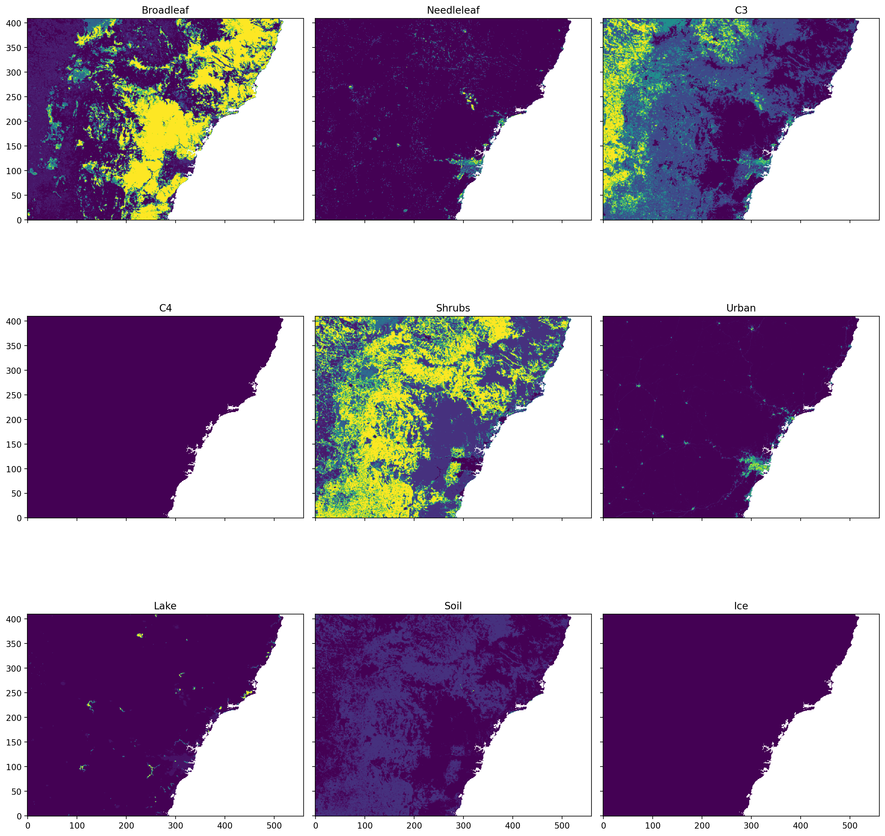
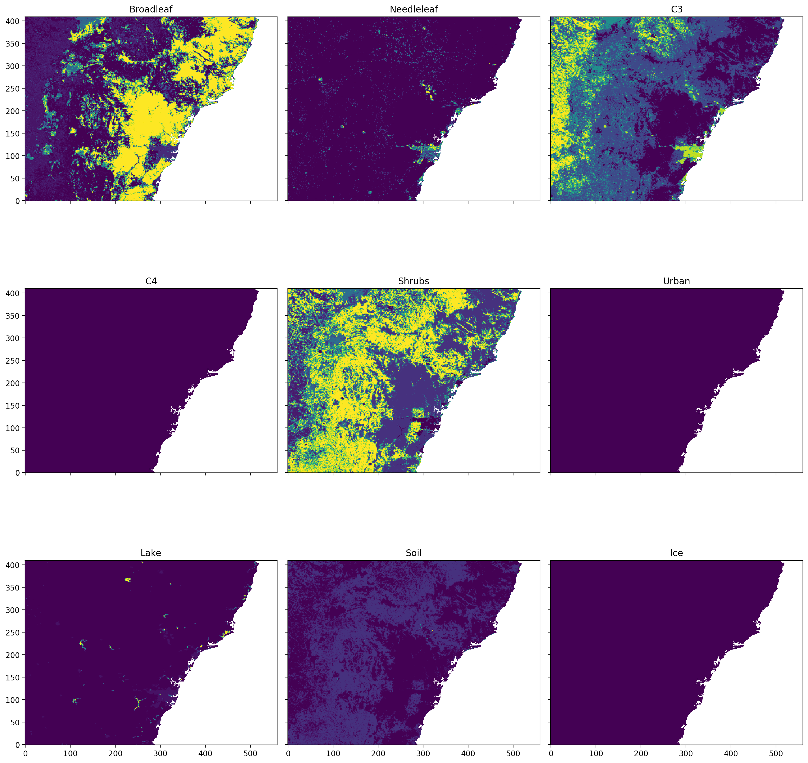

To remove urban tile use: [this code](ancil_lct_postproc_no_urban.py).

**Description:**

Zeros the urban land-cover tile (id=6) and re-proportions selectednon-urban tiles so each grid cell sums to 1.0. Some tiles are exluded
from re-proportioning (ice, lake, needleleaf) to preserve their values.

**Usage:**

Run the Regional Nesting Suite as normal, but "hold" the task: `[model]_ancil_lct_postproc_c4`, then run this script with the following command:

```
module purge; module use /g/data/xp65/public/modules;module load conda/analysis3-25.08

python ancil_lct_postproc_no_urban.py $PATH_TO_ANCILS/qrparm.veg.frac_cci_pre_c4 --output $PATH_TO_ANCILS/qrparm.veg.frac_cci_no_urban
```

You must rename the output manually:

`cp $PATH_TO_ANCILS/qrparm.veg.frac_cci_no_urban $PATH_TO_ANCILS/qrparm.veg.frac_cci_pre_c4`

Then "release" the task and continue with the rest of the suite as normal.

Result:

Before


After
